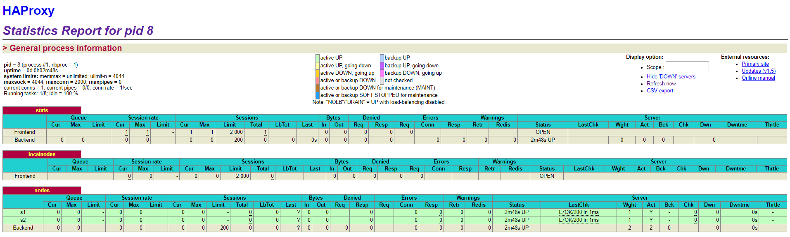

title: Lab 04 - Docker
---

Thibaud Besseau & Luana Martelli

## Lab 04 - Docker


### Table of contents
1. [Introduction](#introduction)
2. [Task 0: Identify issues and install the tools](#paragraph1)
3. [Task 1: Add a process supervisor to run several processes](#paragraph2)
4. [Task 2: Add a tool to manage membership in the web server cluster](#paragraph3)
5. [Task 3: React to membership changes](#paragraph4)
6. [Task 4: Use a template engine to easily generate configuration files](#paragraph5)
7. [Task 5: Generate a new load balancer configuration when membership changes](#paragraph6)
8. [Task 6: Make the load balancer automatically reload the new configuration](#paragraph7)
9. [Difficulties](#difficulties)
10. [Conclusion](#conclusion)


### Introduction <a name="introduction"></a>

The aim of this lab is to build our own Docker image. Through these steps, we'll become 
familiar with the process supervision for Docker, understand the concept for dynamic scaling 
of an app and, finally, put into practice decentralized management of web server instances. 
The lab is divided in seven parts. The version of HAProxy used is 1.5. 


### <a name="paragraph1"></a>Task 0: Identify issues and install the tools 

#### Identify issues

Suppose further currently your web servers and your load balancer are
deployed like in the previous lab. What are the issues with this
architecture? 

1. <a name="M1"></a>**[M1]** __Do you think we can use the current
   solution for a production environment? What are the main problems
   when deploying it in a production environment?__
   
   No, it's not a good idead to user it in
   a production environment. The main problpem is that we have to 
   delacre each server manually in the conf file (it's a static 
   configuration).It is not made automatically, so it's a lof of work 
   to maintain. Beside, each time we add a server, we need to reboot. 

2. <a name="M2"></a>**[M2]** __Describe what you need to do to add new
   `webapp` container to the infrastructure. Give the exact steps of
   what you have to do without modifiying the way the things are
   done. Hint: You probably have to modify some configuration and
   script files in a Docker image.__

   We need to change ha/config/haproxy.cfg file
   and add a new line : 
   ```bash
      server s3 <s3>:3000 check
   ```
   Same thing in the ha/scripts/run.sh file:
   ```bash
   sed -i 's/<s3>/$S3_PORT_3000_TCP_ADDR/g' /usr/local/etc/haproxy/haproxy.cfg
   ```
   Since we modify the config of ha container, we need to re-build it. When 
   it's done, we can normally run the ha container and don't forget to run also
   the new server s3.

3. <a name="M3"></a>**[M3]** __Based on your previous answers, you have
   detected some issues in the current solution. Now propose a better
   approach at a high level.__

   The configuration should not be static but dynamic.
   We should use a tool or a program to communicate with te load balancer to tell
   it which server are up or down. 

4. <a name="M4"></a>**[M4]** __You probably noticed that the list of web
  application nodes is hardcoded in the load balancer
  configuration. How can we manage the web app nodes in a more dynamic
  fashion?__

  As said previously, we should user a special tool that 
  will say to the load balancer all servers that are connected. For this lab, we 
  will be introduced to the serf agent. 

5. <a name="M5"></a>**[M5]** __In the physical or virtual machines of a
   typical infrastructure we tend to have not only one main process
   (like the web server or the load balancer) running, but a few
   additional processes on the side to perform management tasks.
   For example to monitor the distributed system as a whole it is
   common to collect in one centralized place all the logs produced by
   the different machines. Therefore we need a process running on each
   machine that will forward the logs to the central place. (We could
   also imagine a central tool that reaches out to each machine to
   gather the logs. That's a push vs. pull problem.) It is quite
   common to see a push mechanism used for this kind of task.
   Do you think our current solution is able to run additional
   management processes beside the main web server / load balancer
   process in a container? If no, what is missing / required to reach
   the goal? If yes, how to proceed to run for example a log
   forwarding process?__

   We need a central tool that will bypass our 
   problem of one process per container. In this lab, we will use s6. 

6. <a name="M6"></a>**[M6]** __In our current solution, although the
   load balancer configuration is changing dynamically, it doesn't
   follow dynamically the configuration of our distributed system when
   web servers are added or removed. If we take a closer look at the
   `run.sh` script, we see two calls to `sed` which will replace two
   lines in the `haproxy.cfg` configuration file just before we start
   `haproxy`. You clearly see that the configuration file has two
   lines and the script will replace these two lines.
   What happens if we add more web server nodes? Do you think it is
   really dynamic? It's far away from being a dynamic
   configuration. Can you propose a solution to solve this?__

   No, it's not, because we need to change two files to 
   add more nodes (see answer 2). A better solution would be that each server announces
   itself to the other and the load balancer when it's up. 

#### Install the tools

We already set up everything in the previous lab. Here is our output after the following command : 
```bash
vagrant@ubuntu-14:~$ docker ps
CONTAINER ID        IMAGE                  COMMAND                  CREATED             STATUS              PORTS                                                                NAMES
ca41d450c676        softengheigvd/ha       "/docker-entrypoint.…"   24 seconds ago      Up 23 seconds       0.0.0.0:80->80/tcp, 0.0.0.0:1936->1936/tcp, 0.0.0.0:9999->9999/tcp   ha
c160fa8469fa        softengheigvd/webapp   "/scripts/run.sh"        24 seconds ago      Up 23 seconds       3000/tcp                                                             s2
78a6d9e876a0        softengheigvd/webapp   "/scripts/run.sh"        25 seconds ago      Up 24 seconds       3000/tcp                                                             s1
```


**Deliverables**:

1. __Take a screenshot of the stats page of HAProxy at
   <http://192.168.42.42:1936>. You should see your backend nodes.__

   

2. __Give the URL of your repository URL in the lab report.__

https://github.com/LuanaMartelli/Teaching-HEIGVD-AIT-2016-Labo-Docker


### <a name="paragraph2"></a>Task 1: Add a process supervisor to run several processes

> In this task, we will learn to install a process supervisor that
  will help us to solve the issue presented in the question
  [M5](#M5). Installing a process supervisor gives us the ability to
  run multiple processes at the same time in a Docker environment.


**Deliverables**:

1. __Take a screenshot of the stats page of HAProxy at
   <http://192.168.42.42:1936>. You should see your backend nodes. It
   should be really similar to the screenshot of the previous task.__

   

2. __Describe your difficulties for this task and your understanding of
   what is happening during this task. Explain in your own words why
   are we installing a process supervisor. Do not hesitate to do more
   research and to find more articles on that topic to illustrate the
   problem.__

   As said in the [A5](#A5), we cannot run more than one process per 
   container. Thanks to a supervisor, we ca bypass this limitation. 
   Now, we will be able to run a server and a process to log it. 
   The main problem for this part was to understand all the theroy 
   behind the idea of a supervisor process and how Docker / virtual machines
   run.
   


### <a name="paragraph3"></a>Task 2: Add a tool to manage membership in the web server cluster

> In this task, we will focus on how to make our infrastructure more
  flexible so that we can dynamically add and remove web servers. To
  achieve this goal, we will use a tool that allows each node to know
  which other nodes exist at any given time.


**Deliverables**:

1. __Provide the docker log output for each of the containers: `ha`,
   `s1` and `s2`.__

   We run the HAProxy first. The logs are avaliables under /logs/task2/Ha_Start_First/


2. __Give the answer to the question about the existing problem with the
   current solution.__

   First run haproxy. If you do not, the child nodes will not be linked to it


3. __Give an explanation on how `Serf` is working. Read the official
   website to get more details about the `GOSSIP` protocol used in
   `Serf`. Try to find other solutions that can be used to solve
   similar situations where we need some auto-discovery mechanism.__

   TODO


### <a name="paragraph4"></a>Task 3: React to membership changes


> We reached a state where we have nearly all the pieces in place to make the infrastructure
  really dynamic. At the moment, we are missing the scripts that will react to the events
  reported by `Serf`, namely member `leave` or member `join`.

> We will start by creating the scripts in [ha/scripts](ha/scripts). So create two files in
  this directory and set them as executable. 


**Deliverables**:

1. __Provide the docker log output for each of the containers:  `ha`, `s1` and `s2`.
   Put your logs in the `logs` directory you created in the previous task.__

   The logs are available in the files   
   	- /logs/task3/ha.txt
   	- /logs/task3/s1.txt
   	- /logs/task3/s2.txt


3. __Provide the logs from the `ha` container gathered directly from the `/var/log/serf.log`
   file present in the container. Put the logs in the `logs` directory in your repo.__

   Here are the logs we got :
```
	Member join script triggered
	Member join event received from: 2a70b5b171fb with role balancer
	Member join script triggered
	Member join event received from: ade84b5d0a98 with role backend
	Member join script triggered
	Member join event received from: 2fd4ce8bff6a with role backend
```
   They are available in the files   
   	- /logs/task3/serf_logs/serf.txt


### <a name="paragraph5"></a>Task 4: Use a template engine to easily generate configuration files

> There are several ways to generate a configuration file from variables
  in a dynamic fashion. In this lab we decided to use `NodeJS` and
  `Handlebars` for the template engine.  
  In our case our template is the `HAProxy` configuration file in which
  we put placeholders written in the template language. Our data model
  is the data provided by the handler scripts of `Serf`. And the
  resulting document coming out of the template engine is a
  configuration file that HA proxy can understand where the placeholders
  have been replaced with the data.


**Deliverables**:

1. __You probably noticed when we added `xz-utils`, we have to rebuild
   the whole image which took some time. What can we do to mitigate
   that? Take a look at the Docker documentation on
   [image layers](https://docs.docker.com/engine/userguide/storagedriver/imagesandcontainers/#images-and-layers).
   Tell us about the pros and cons to merge as much as possible of the
   command. In other words, compare:__

  ```
  RUN command 1
  RUN command 2
  RUN command 3
  ```

  __vs.__

  ```
  RUN command 1 && command 2 && command 3
  ```

  __There are also some articles about techniques to reduce the image
  size. Try to find them. They are talking about `squashing` or
  `flattening` images.__

  A Docker image is built up from layers. Each layer is an instruction in the Dockerfile. It is a better practice to have a minimal number of layers in an image, because the size can become fat really quickly. That's why put all commands in one RUN is a better practice. It will reduce the size of the image. On an other hand, each layer is cached, so when an image is re-built, it could go faster to not re-download all the packages. So in this case, the first solution is better. 
  An other problem with a merge of commands, like presented here, is that it becomes quickly not really easy to read when there is a lot of instructions.  
  Regarding the apt-get update and apt-get install, there are a lot of articles, saying that they should be put in one RUN command, because of a cache reason. A single apt-get update will be cached, as said previously, and not re-run every time you need to install something. So it might download an old version of the package. 

  Squash or flatten mean that multiples layers of an image will become one single layer. The result of this is to reduce the size of an image. It is a very powerful technique, howerver, it should not be used for every image. You will probably sacrify some functionnality in the process, so it's important to think about it twice. But, let say, if we use someonelse's image and it's too heavy and we want to optimize its size, it is a good tool to use.  

2. __Propose a different approach to architecture our images to be able
   to reuse as much as possible what we have done. Your proposition
   should also try to avoid as much as possible repetitions between
   your images.__

   First, we could optimize the size of the image removing all the packages we installed and that we no longer need (wget curl vim rsyslog, ...) or use an option such as --no-install-recommends.

3. __Provide the `/tmp/haproxy.cfg` file generated in the `ha` container
   after each step.  Place the output into the `logs` folder like you
   already did for the Docker logs in the previous tasks. Three files
   are expected.
   In addition, provide a log file containing the output of the 
   `docker ps` console and another file (per container) with
   `docker inspect <container>`. Four files are expected.__

   Files are available under /logs/task4/
    - ha_haproxy-cfg_ha_started
   
   ```
   root@a70a8df4dbf7:/# cat /tmp/haproxy.cfg
   Container a70a8df4dbf7 has joined the Serf cluster with the following IP address: 172.18.0.2
   ``` 

    - ha_haproxy-cfg_s1_started

   ```
   root@a70a8df4dbf7:/# cat /tmp/haproxy.cfg
   Container d5a0f986f7e2 has joined the Serf cluster with the following IP address: 172.18.0.3
   ```

    - ha_haproxy-cfg_s2_started

   ```
   root@a70a8df4dbf7:/# cat /tmp/haproxy.cfg
   Container 6cec01d549c1 has joined the Serf cluster with the following IP address: 172.18.0.4
   ```
   
   
   - docker-ps

   ```
   CONTAINER ID        IMAGE                  COMMAND             CREATED             STATUS              PORTS                                                                                    NAMES
6cec01d549c1        softengheigvd/webapp   "/init"             6 minutes ago       Up 6 minutes        3000/tcp, 7373/tcp, 7946/tcp                                                             s2
d5a0f986f7e2        softengheigvd/webapp   "/init"             7 minutes ago       Up 7 minutes        3000/tcp, 7373/tcp, 7946/tcp                                                             s1
a70a8df4dbf7        softengheigvd/ha       "/init"             10 minutes ago      Up 10 minutes       0.0.0.0:80->80/tcp, 7373/tcp, 0.0.0.0:1936->1936/tcp, 0.0.0.0:9999->9999/tcp, 7946/tcp   ha 
  ```

  - docker-inspect-ha
  - docker-inspect-s1
  - docker-inspect-s2

  These three last files are not shown here, as they are too big. 


4. __Based on the three output files you have collected, what can you
   say about the way we generate it? What is the problem if any?__

TODO


### <a name="paragraph6"></a>Task 5: Generate a new load balancer configuration when membership changes

> At this stage, we have:

  - Two images with `S6` process supervisor that starts a Serf agent
    and an "application" (HAProxy or Node web app).

  - The `ha` image contains the required stuff to react to `Serf`
    events when a container joins or leaves the `Serf` cluster.

  - A template engine in the `ha` image is ready to be used to
    generate the HAProxy configuration file.

> Now, we need to refine our `join` and `leave` scripts to generate a
  proper HAProxy configuration file.


**Deliverables**:

1. __Provide the file `/usr/local/etc/haproxy/haproxy.cfg` generated in
   the `ha` container after each step. Three files are expected.
   In addition, provide a log file containing the output of the 
   `docker ps` console and another file (per container) with
   `docker inspect <container>`. Four files are expected.__


   All files are availables under the folder /logs/task5.  
   Here is a copy of some : 

   - haproxy-config-ha-started
   - haproxy-config-s1-started
   - haproxy-config-s2-started

   This files are not shown here, as they are too big.

   - docker-ps

   ```
   CONTAINER ID        IMAGE                  COMMAND             CREATED             STATUS              PORTS                                                                                    NAMES
037244eb875d        softengheigvd/webapp   "/init"             2 minutes ago       Up 2 minutes        3000/tcp, 7373/tcp, 7946/tcp                                                             s2
6040af1c817f        softengheigvd/webapp   "/init"             8 minutes ago       Up 8 minutes        3000/tcp, 7373/tcp, 7946/tcp                                                             s1
7c75951f8414        softengheigvd/ha       "/init"             16 minutes ago      Up 16 minutes       0.0.0.0:80->80/tcp, 7373/tcp, 0.0.0.0:1936->1936/tcp, 0.0.0.0:9999->9999/tcp, 7946/tcp   ha
  ```

  - docker-inspect-ha
  - docker-inspect-s1
  - docker-inspect-s2

  These three last files are not shown here, as they are too big.


2. __Provide the list of files from the `/nodes` folder inside the `ha` container.
   One file expected with the command output.__

   - nodes_directory_list

   ```
   root@7c75951f8414:/nodes# ls -la
total 16
drwxr-xr-x  2 root root 4096 Dec 15 08:42 .
drwxr-xr-x 74 root root 4096 Dec 15 08:46 ..
-rw-r--r--  1 root root   24 Dec 15 08:42 037244eb875d
-rw-r--r--  1 root root   24 Dec 15 08:37 6040af1c817f 
   ```

3. __Provide the configuration file after you stopped one container and
   the list of nodes present in the `/nodes` folder. One file expected
   with the command output. Two files are expected.
   In addition, provide a log file containing the output of the
   `docker ps` console. One file expected.__

   - haproxy-config-after-s2-stop 

   Not shown here, as too big 

   - nodes_directory_list_after_s2_stop

   ```
   root@7c75951f8414:/nodes# ls -la
total 12
drwxr-xr-x  2 root root 4096 Dec 15 08:54 .
drwxr-xr-x 74 root root 4096 Dec 15 08:46 ..
-rw-r--r--  1 root root   24 Dec 15 08:37 6040af1c817f
   ```

   - docker_ps_after-s2-stop

  ```
  CONTAINER ID        IMAGE                  COMMAND             CREATED             STATUS              PORTS                                                                                    NAMES
6040af1c817f        softengheigvd/webapp   "/init"             21 minutes ago      Up 21 minutes       3000/tcp, 7373/tcp, 7946/tcp                                                             s1
7c75951f8414        softengheigvd/ha       "/init"             29 minutes ago      Up 29 minutes       0.0.0.0:80->80/tcp, 7373/tcp, 0.0.0.0:1936->1936/tcp, 0.0.0.0:9999->9999/tcp, 7946/tcp   ha
  ```


### <a name="paragraph7"></a>Task 6: Make the load balancer automatically reload the new configuration

> The only thing missing now is to make sure the configuration of
  HAProxy is up-to-date and taken into account by HAProxy.

> We will try to make HAProxy reload his config with minimal
  downtime. At the moment, we will replace the line `TODO: [CFG] Replace
  this command` in [ha/services/ha/run](ha/services/ha/run) by the
  following script part. As usual, take the time to read the comments.


**Deliverables**:

1. __Take a screenshots of the HAProxy stat page showing more than 2 web
   applications running. Additional screenshots are welcome to see a
   sequence of experimentations like shutting down a node and starting
   more nodes.
   Also provide the output of `docker ps` in a log file. At least 
   one file is expected. You can provide one output per step of your
   experimentation according to your screenshots.__

   Here is an image of the HA with three nodes up and onw down :  
  


  Here, there is an image with 4 nodes up :  
  

  You can find in the log folder, under task6 the output of the `docker ps` when multiple nodes are running. Here is a copy : 

```
  CONTAINER ID        IMAGE                  COMMAND             CREATED             STATUS              PORTS                                                                                    NAMES
cfb082d22922        softengheigvd/webapp   "/init"             3 seconds ago       Up 1 second         3000/tcp, 7373/tcp, 7946/tcp                                                             s4
5bf8b5ab7cfa        softengheigvd/webapp   "/init"             7 seconds ago       Up 6 seconds        3000/tcp, 7373/tcp, 7946/tcp                                                             s3
df2de72e62e0        softengheigvd/ha       "/init"             9 minutes ago       Up 9 minutes        0.0.0.0:80->80/tcp, 7373/tcp, 0.0.0.0:1936->1936/tcp, 0.0.0.0:9999->9999/tcp, 7946/tcp   ha
ec303fcb4ddc        softengheigvd/webapp   "/init"             9 minutes ago       Up 9 minutes        3000/tcp, 7373/tcp, 7946/tcp                                                             s2
c241dc9788b5        softengheigvd/webapp   "/init"             9 minutes ago       Up 9 minutes        3000/tcp, 7373/tcp, 7946/tcp  
```
   

  Finally, a `docker ps` when one node is down : 
```
CONTAINER ID        IMAGE                  COMMAND             CREATED             STATUS              PORTS                                                                                    NAMES
cfb082d22922        softengheigvd/webapp   "/init"             10 minutes ago      Up 10 minutes       3000/tcp, 7373/tcp, 7946/tcp                                                             s4
5bf8b5ab7cfa        softengheigvd/webapp   "/init"             10 minutes ago      Up 10 minutes       3000/tcp, 7373/tcp, 7946/tcp                                                             s3
df2de72e62e0        softengheigvd/ha       "/init"             20 minutes ago      Up 20 minutes       0.0.0.0:80->80/tcp, 7373/tcp, 0.0.0.0:1936->1936/tcp, 0.0.0.0:9999->9999/tcp, 7946/tcp   ha
ec303fcb4ddc        softengheigvd/webapp   "/init"             20 minutes ago      Up 20 minutes       3000/tcp, 7373/tcp, 7946/tcp 
```


2. __Give your own feelings about the final solution. Propose
   improvements or ways to do the things differently. If any, provide
   references to your readings for the improvements.__

This solution is quite good as it can manage itself. But, we could improve this solution by adding more automatism. For instance, when a node is down, there is no alert generated, we have to check it manually. It could be interesting to monitor logs and when one is down, re-create a new one with a script. 


3. __(Optional:) Present a live demo where you add and remove a backend container.__

The demonstration was made on the 22nd December. 


## <a name="difficulties"></a> Difficulties

On of the computer used for this lab is running under Windows. It was hard to set up, as all tools are done for Linux. For instance, every time we changed a line in a config file, we had to kill the virtual machine, pratically reboot the computer and start all over again.  

Another thing that has been difficult was to find all the information we needed to fully understand the lab. Sometimes, we ended up in forums where people had poor explanation about the theory and it was hard to understand.


## <a name="conclusion"></a> Conclusion

In this lab, we learnt how to use the HA proxy. It was interesting as there is a lot of tools to do pratically whatever we want. But it would be a good thing to improve this system, by adding scripts to automatize the work.